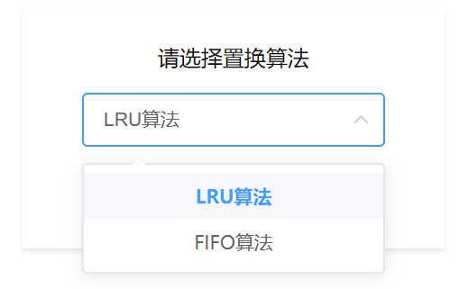

# 内存管理 - 请求调页存储管理方式模拟
>​	**学号**				1851197
​	**姓名**				周楷彬
​	**指导老师**		王冬青老师
​	**上课时间**		周三五六节/周五一二节
​	**联系方式**		*email:* 824999404@qq.com
## 目录
[TOC]
## 项目需求

### 基本任务

假设每个页面可存放10条指令，分配给一个作业的内存块为4。模拟一个作业的执行过程，该作业有320条指令，即它的地址空间为32页，目前所有页还没有调入内存。

### 功能描述

- 在模拟过程中，如果所访问指令在内存中，则显示其物理地址，并转到下一条指令；如果没有在内存中，则发生缺页，此时需要记录缺页次数，并将其调入内存。如果4个内存块中已装入作业，则需进行页面置换。
- 所有320条指令执行完成后，计算并显示作业执行过程中发生的缺页率。

- 置换算法可以选用FIFO或者LRU算法

- 作业中指令访问次序可以按照下面原则形成：  

  ​    50%的指令是顺序执行的，25%是均匀分布在前地址部分，25％是均匀分布在后地址部分

### 项目目的

- 页面、页表、地址转换
- 页面置换过程
- 加深对请求调页系统的原理和实现过程的理解。

## 开发环境

- **开发环境:** Windows 10

- **开发软件:** 

  1. **Visual Studio Code** *1.45.0*
  2. **Google Chrome** *83.0.4103.97*

- **开发语言:** html, javascript, css

- **主要引用:**
  1. Vue.js
  2. Element UI

## 操作说明

* 解压`src.zip`，双击文件夹内的`index.html`，在浏览器中打开(请用Chrome、Firefox或Microsoft Edge，程序不兼容IE),打开后界面如下图所示

* 选择置换算法(LRU算法/FIFO算法)


* 选择运行方式(单步/连续)和运行速度大小，点击**开始**按钮进行请求调页存储管理方式模拟


* 在连续运行方式下程序会按照运行速度大小连续执行指令，点击**暂停**按钮可暂停模拟，点击**继续**按钮可继续模拟；在单步运行方式下程序每次只执行一条指令，点击**下一步**按钮可执行下一条指令

* 上方会显示从开始到当前指令的缺页数和缺页率

* 下方的日志信息会显示指令地址和请求调页情况

* 左边的指令执行情况表会显示最近执行的几条指令的地址和页号

* 右边的内存情况表会显示当前内存块是否被占用、存放的页号和相应页的地址范围

* 点击**重置**会清空内存块以及日志信息、指令执行情况表、缺页数和缺页率, 此时可再次选择置换算法等, 并再次进行请求调页存储管理方式模拟

## 系统分析
### 置换算法

#### LRU算法

- **当前页面已经在内存中** $\Rightarrow$ 不需要进行调页
- 当**内存中页面数小于内存容量**时 $\Rightarrow$ 直接将页面顺序调入到内存的空闲块中
- 当**内存已满**时 $\Rightarrow$ 每次替换掉最近最少使用的内存块中的页面
  - **维护一个`LRU队列`:** 当页面被调入内存中时，将该页面添加到队列尾部；当被置换时，将该页面从队列中删除，并将新调入的页面添加到队列尾部；当被访问时，将队列中对应页面调整到队列尾部。因此用LRU算法得到的将被置换的页面即`LRU队列`头部（第一个）页面

#### FIFO算法

- **当前页面已经在内存中** $\Rightarrow$ 不需要进行调度
- 当**内存中页面数小于内存容量**时 $\Rightarrow$ 直接将页面顺序加入到内存的空闲块中
- 当**内存满**时 $\Rightarrow$ 每次一次替换掉最早调入内存的页面
  * 因为模拟内存块表是按照分配的先后顺序排列的，所以FIFO算法会选择链表中的第一个页面进行置换。置换实现如下：将第一个页面删除，将剩余页面上移，然后再将新调入的页面添加到内存块表末尾，以保持内存块表的有序

### 执行模式

#### 320条指令产生方式

为了保证320 条指令能够随机产生，并且能够均匀分布，采用了下面这种循环产生指令的方式：

- 在0－319条指令之间，随机选取一个起始执行指令，如序号为m

- 顺序执行下一条指令，即序号为m+1的指令

- 通过随机数，跳转到前地址部分0~m-1中的某个指令处，其序号为m1

- 顺序执行下一条指令，即序号为m1+1的指令

- 通过随机数，跳转到后地址部分m1+2~319中的某条指令处，其序号为m2

- 顺序执行下一条指令，即m2+1处的指令。

重复跳转到前地址部分、顺序执行、跳转到后地址部分、顺序执行的过程，直到执行完320条指令。


## 系统设计
### 界面设计

1. **整体设计**

2. **选择算法**: 
``` html
<!-- 选择算法 -->
<el-col class="card action" :span="6">
    <el-row type="flex" justify="center">
        <p>请选择置换算法</p>
    </el-row>
    <el-row type="flex" justify="center">
        <el-select v-model="algorithm" :disabled="isStart">
            <el-option
                v-for="item in alogOptions"
                :key="item.value"
                :label="item.label"
                :value="item.value">
            </el-option>
            </el-select>
    </el-row>
</el-col>
```
3. **选择运行速度大小**
``` html
<el-row type="flex" justify="center">
    <el-col :span="12"><p>运行速度(毫秒/指令):</p></el-col>
    <el-col :span="12">
        <el-slider v-model="speed" :disabled="isStart" style="margin-top: 8px;"
        :min="10" :max="500" step="10"></el-slider>
    </el-col>
</el-row>
```
4. **运行控制**
``` html
<el-col class="card action" id="buttons" :span="6">
    <!-- 运行控制 -->
    <el-row type="flex" justify="center" >
        <p>请选择运行方式：
            <!-- 单步/连续 -->
            <el-switch
            v-model="isContinuted" :disabled="isStart"
            active-text="连续" inactive-text="单步">
            </el-switch>
        </p>
    </el-row>
    <el-row type="flex" justify="center" gutter="40"> 
        <el-col :span="6">
            <!-- 开始/暂停/继续按钮 -->
            <el-button type="primary" :disabled="isEnd||(!isContinuted&&isStart)" 
            @click="onStartClick()" plain>
                {{getStartBtnText() }}
            </el-button>
        </el-col>
        <el-col :span="7">
            <!-- 下一步 -->
            <el-button type="primary" :disabled="!isStart||isEnd" 
            @click="onNextClick()" plain>下一步</el-button>
        </el-col>
        <el-col :span="6">
            <!-- 重置 -->
            <el-button type="primary" plain
            @click="onResetClick()">重置</el-button>
        </el-col>
    </el-row>
</el-col>
```
4. **缺页数和缺页率**
``` html
<el-row class="text-H" type="flex" justify="center">
    <el-col :span="6"><p>缺页数：</p></el-col>
    <el-col :span="2" style="color: #1E90FF; font-weight: bold;">
        <p>{{getMissNum()}}</p>
    </el-col>
</el-row>
<el-row class="text-H" type="flex" justify="center">
    <el-col :span="6"><p>缺页率：</p></el-col>
    <el-col :span="2" style="color: #1E90FF; font-weight: bold;">
        <p>{{getMissRate()}}%</p>
    </el-col>
</el-row>
```
5. **指令执行情况**
``` html
<div class="card">
    <p>指令执行情况</p>
    <el-table :row-class-name="tableRowClassName"
    :data="cmdList" max-height="250">
    <el-table-column
        prop="id"
        label="指令编号"
        width="100">
        <template slot-scope="scope">
            {{scope.row.id}}
            </template>
    </el-table-column>
    <el-table-column
        prop="address"
        label="指令地址"
        width="100">
        <template slot-scope="scope">
            {{scope.row.address}}
            </template>
    </el-table-column>
    <el-table-column
    prop="page"
    label="指令页号"
    width="100">
    <template slot-scope="scope">
        {{getPage(scope.row.address)}}
    </template>
    </el-table-column>
    </el-table>
</div>
```
6. **内存情况**
``` html
<div class="card">
    <p>内存情况</p>
    <el-table
        :data="memBlocks" max-height="250">
        <el-table-column
            prop="id"
            label="内存块编号"
            width="100">
            <template slot-scope="scope">
                {{scope.$index}}
                </template>
        </el-table-column>
        <el-table-column
            prop="page"
            label="页号"
            width="100">
            <template slot-scope="scope">
                {{(scope.row==-1)?'空':scope.row}}
                </template>
        </el-table-column>
        <el-table-column
            prop="range"
            label="地址范围"
            width="100">
            <template slot-scope="scope">
                {{ getRange(scope.row) }}
            </template>
        </el-table-column>
    </el-table>
</div>
```
7. **日志信息**
``` html
<!-- 日志信息 -->
<el-card id="logBox" class="box-card">
    <div slot="header" class="clearfix">
        <span>日志信息</span>
    </div>
    <div  v-for="message in logList">
        <br>
        {{ message }}
    </div>
</el-card>
```
### 类设计

**内存类:** 包含内存大小、指令数、运行次数、调页次数、最近执行的指令、LRU队列、内存块表、日志消息表
``` js
/**
 * 内存类
 * @param {内存大小} MemSize
 * @param {指令数} CommandSize
 */
function Memory(MemSize,CommandSize)
{
    this.CommandSize=CommandSize;       
    this.MemSize=MemSize;
    this.block=new Array(MemSize);      //内存块
    this.LRU_Queue=[];                  //最近最少使用队列
    this.runTime=0;                     //运行次数
    this.adjustTime=0;                  //调页次数
    this.commandList=[];                //最近执行的指令
    this.logList=new Array(MemSize);    //日志消息

}
```
### 状态设计

1. 内存块为空标识：`const EMPTY=-1;`
2. 访问页命中，不缺页：`const HIT=1; `
3. 缺页，内存未满：`const REMEMPTY=2;`
4. 缺页，内存已满：`const ADJUST=3;  `

## 系统实现
### 实例化Vue
* 实例化Vue，将html界面内容绑定到相应是js中的变量
* 为界面中的控制设置相应的事件处理函数：开始/暂停/继续按钮点击事件、下一步按钮点击事件、重置按钮点击事件、计算缺页率、获取地址范围
* 如果点击**开始**按钮，调用函数`Simulate`执行指令，**单步**运行方式下只执行一条指令，**连续**运行方式下使用定时器按照设定的速度连续执行
* 如果点击**重置**按钮，清空内存块以及日志信息、指令执行情况表、缺页数和缺页率
``` js
//实例化Vue
app=new Vue({
    el:'#app',
    data:{
        title:"请求调页存储管理方式模拟",
        alogOptions:[
            {
                value:'LRU',
                label:'LRU算法'
            },
            {
                value:'FIFO',
                label:'FIFO算法'
            }
        ],
        algorithm:'LRU',  //选择的算法
        logList:memory.logList,    //日志消息列表
        memBlocks:memory.block,     //内存块
        cmdList:memory.commandList, 
        speed:10,
        simulate:Simulate,
        isStart:false,      //开始标志
        isEnd:false,        //结束标志
        isContinuted:true,  //运行方式，连续还是单步
        isPause:false       //暂停标志
    },
    methods:{
        getMissRate(){              //计算缺页率
            if(memory.runTime==0)
                return 0;
            else
                return (memory.adjustTime*100/memory.runTime).toFixed(2);
        },
        getMissNum(){
            return memory.adjustTime;
        },
        getPage(address){
            return Math.floor(address/10);
        },
        getRange(page){                 //获取地址范围
            if(page==-1)
                return '无';
            else
            {
                return '['+page*10+','+(page+1)*10+')';
            }
        },
        getStartBtnText(){          //根据运行状态改变开始/暂停/继续按钮的文字
            if(this.isStart)
            {
                if(this.isPause) return '继续';
                else return '暂停';
            }
            else return '开始';
        },
        onStartClick(){                 //开始/暂停/继续按钮点击事件
            if(!this.isStart)
            {
                this.isStart=true;
                if(this.isContinuted)
                {
                    myTimer=setInterval(this.simulate,this.speed);
                }
            }
            else
            {
                if(this.isContinuted)
                {
                    if(this.isPause)
                    {
                        this.isPause=false;
                        myTimer=setInterval(this.simulate,this.speed);
                    }
                    else
                    {
                        this.isPause=true;
                        if(myTimer!=null)
                        {
                            clearInterval(myTimer);
                        }
                    }

                } 
            }

        },
        onNextClick(){          //下一步按钮点击事件
            if(this.isStart)
            {
                this.simulate();
            }
        },
        onResetClick()          //重置按钮点击事件
        {
            this.isStart=false;
            this.isPause=false;
            this.isEnd=false;
            Init();
            if(myTimer!=null)
            {
                clearInterval(myTimer);
            }
        },
        tableRowClassName({row, rowIndex}) 
        {
            if (rowIndex === 0) {
                return 'currentCmd';
            } else {
                return '';
            }
        }
    }
});
```
### 请求调页存储管理方式模拟
* 变量`runTime`表示当前执行第几条指令
* 依据`runTime`值进行分支处理:
    * 如果`runTime`值小于总指令数则执行下一条指令
    * 如果`runTime`值大于等于总指令数  $\Rightarrow$  所有指令已经执行完毕  $\Rightarrow$ 连续运行方式下停止定时器
``` js 
// 请求调页存储管理方式模拟
function Simulate()
{

    if(memory.runTime>=memory.CommandSize)
    {
        app.isEnd=true;
        if(app.isContinuted)
        {
            if(myTimer!=null)
            {
                clearInterval(myTimer);
            }
        }
    }
    else
    {
        nextStep();
        //日志信息滚动到底部
        var logbox=document.getElementById("logBox");
        logbox.scrollTop=logbox.scrollHeight;
    }


}
```

### 生成一条指令
* 如果执行第0条指令$\Rightarrow$随机选取一个起始指令
* 否则，根据`runTime%4`判断执行指令的类型：
    * `runTime%4==1`或`runTime%4==3`$\Rightarrow$顺序执行下一条指令
    * `runTime%4==2`$\Rightarrow$跳转到前地址部分
    * `runTime%4==0`$\Rightarrow$跳转到后地址部分
* 调用`execute`函数执行指令
* 更新页面中的指令执行情况表和内存情况表
* 指令执行数`runTime`加1
``` js 
//生成一条指令并执行
function nextStep()
{
    var aim;
    if(memory.runTime==0)
    {
        //随机选取一个起始指令
        aim = getRand(0, memory.CommandSize - 1);
    }
    else
    {
        aim=memory.commandList[0].address;
        var type=memory.runTime%4;
        switch(type)
        {
            case 1:
            case 3:
                aim++;  //顺序执行下一条指令
                break;
            case 2:
                aim = getRand(0, aim - 1);   //跳转到前地址部分
                break;
            case 0:
                aim = getRand(aim + 1, memory.CommandSize- 1);    //跳转到后地址部分
                break;
        }
    }
    memory.commandList.unshift({id:memory.runTime,address:aim});
    if(memory.commandList.length>4)
    {
        memory.commandList.pop();
    }
    execute(aim); 
    memory.block.unshift(memory.block.shift());     //为了更新页面
    memory.runTime++;
}
```
### 执行一条指令
- 计算页号并输出该指令的信息(物理地址, 页号, 页内地址)
- 检测该页是否已经在内存中:
  - 如果是$\Rightarrow$ 输出已经在内存块中相应信息 $\Rightarrow$ 如果置换算法为LRU算法，将该页面调整到LRU队列尾部
- 如果该页不在内存中，更新调页次数$\Rightarrow$ 检测内存中有无空闲块:
  - 如果有$\Rightarrow$ 将页面顺序调入到内存的空闲块中$\Rightarrow$ 打印没在内存块中, 但是内存块没满相应信息$\Rightarrow$ 如果置换算法为LRU算法，将该页面压入LRU队列
- 如果内存已满，按照相应的置换算法请求调页

``` js 
/* 执行一条指令
 * @param {待执行指令} aim
*/
function execute(aim)
{

	var page = Math.floor(aim / 10);	//计算页号
	var pos = 0;

    addPosMessage(aim,memory.logList);

    // 在内存中查找该页
    for(pos=0;pos<memory.MemSize;pos++){
        if(memory.block[pos] == page)
        {
            if (app.algorithm == 'LRU')     //LRU算法，页面被访问时，将该页面调整到队列尾部
            {
                var index;
                for(var i=0;i<memory.LRU_Queue.length;i++){
                    if(memory.LRU_Queue[i]==pos)
                    {
                        index=i;
                        break;
                    }
                }
                memory.LRU_Queue.splice(index,1);
                memory.LRU_Queue.push(pos);
            }
            addLoadMessage(page,page,pos,HIT,memory.logList);
            return;
        }
    }
    //缺页
	memory.adjustTime++;		//更新调页次数

	/*检测内存中有无空闲块*/
	for (pos=0;pos<memory.MemSize;pos++)
	{
		if (memory.block[pos] == EMPTY)
		{
			memory.block[pos] = page;

			if (app.algorithm == 'LRU')
			{
				memory.LRU_Queue.push(pos);		//将其压入最近最少使用队列
            }
            
            addLoadMessage(page,page,pos,REMEMPTY,memory.logList);
			return;
		}
	}
    //内存已满，调页置换
	var old = adjust(page);
}
```

### 请求调页
- FIFO算法:
    * 将第一个页面删除，将剩余页面上移
    * 将新调入的页面添加到内存块表末尾
- LRU算法:
    * 访问LRU队列头, 获取最近最少使用页面位置, 记录在`pos`中
    * 将该位置填入新的页面
    * 将原来页面从LRU队列中删除
    * 将新调入的页面添加到LRU队列尾部

* 打印缺页，内存已满消息
``` js 
/* 请求调页
 * @returnValue {要被替换掉的页号}
*/
function adjust(page)
{

    var old,pos;
	if (app.algorithm == 'FIFO')
	{
        old=memory.block.shift();             //最先进入的页
        memory.block.push(page);              //新调入的页面
        pos=memory.MemSize-1;
	}
	else
	{
		pos = memory.LRU_Queue.shift();		//将原来页面从队列中删除，重新添加到队列尾部
		memory.LRU_Queue.push(pos);			//将其压入队尾

        old = memory.block[pos];
        
    }
    memory.block[pos]=page;

    addLoadMessage(old,page,pos,ADJUST,memory.logList);

    return old;
}

```
### 添加信息
- 打印指令的物理地址, 页面, 页内地址
- 打印未发生调页的信息
- 打印发生调页的信息

``` js 
// 添加指令地址信息
function addPosMessage(aim,logList)
{   
    var mess='第'+memory.runTime+'条指令：物理地址为：'+aim+'，地址空间页号为：'+Math.floor(aim/10)+'，页内第'+aim%10+'条指令';
    logList.push(mess);
}

//添加是否调页信息
function addLoadMessage(oldPage,newPage,pos,status,logList)
{   
    var mess;
    if(status==HIT){                //命中
        mess=oldPage+'号页已经在内存中第'+pos+'号块中了, 未发生调页';
    }
    else if(status==REMEMPTY){       //缺页，内存未满
        mess='缺页，内存未满，将'+newPage+'号页放在内存中第'+pos+'号块中';
    }
    else{
        mess='缺页，内存已满，调出内存中第'+pos+'块中第'+oldPage+'号页, 调入第'+newPage+'号页';
    }
    mess='第'+memory.runTime+'条指令：'+mess;
    logList.push(mess);
}
```
### 产生随机指令
``` js 
// 返回[low, high]间的随机指令
function getRand(low, high)
{
	// if (high - low == -1) { return high; }		//消除作业中指令访问次序产生high比low小1的问题
	return Math.floor( Math.random() * (high - low) )+ low;
}
```

## 功能实现截屏展示

### LRU算法


### FIFO算法


### 日志信息


### 选择置换算法


### 指令执行情况


### 内存情况


## 运行结果比较
|算法| 缺页数| 缺页率|
| :---:|:---:|:---:|
| LRU算法|  142 |   44.38%  |
|FIFO算法|   151 |   47.19%  |