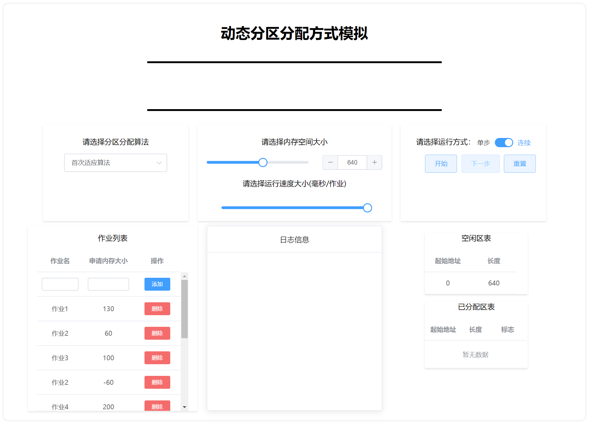
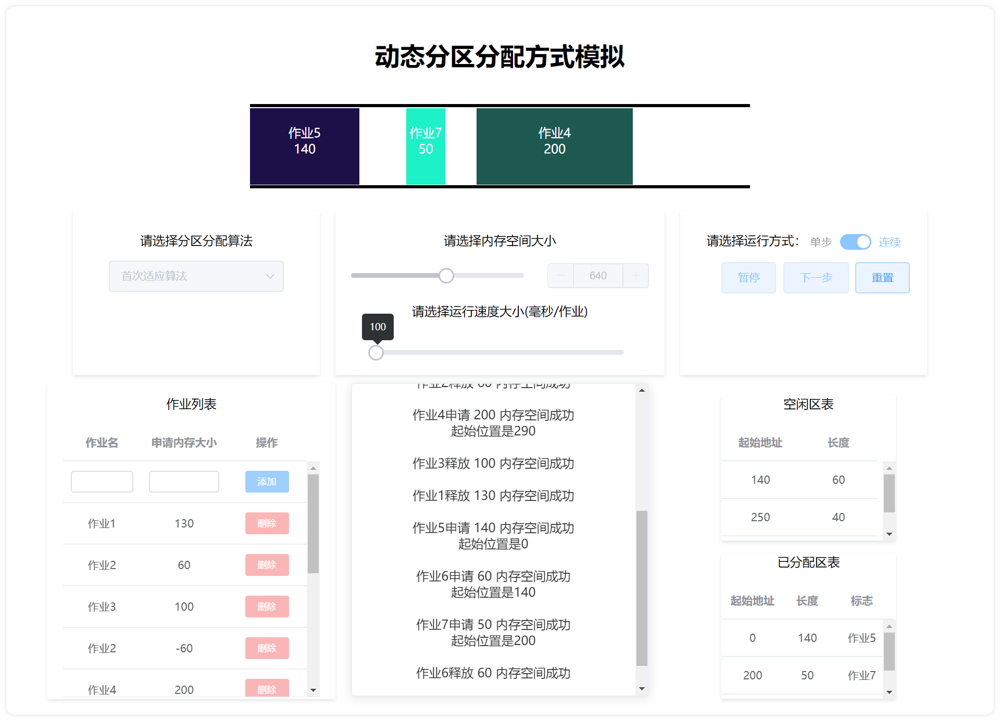
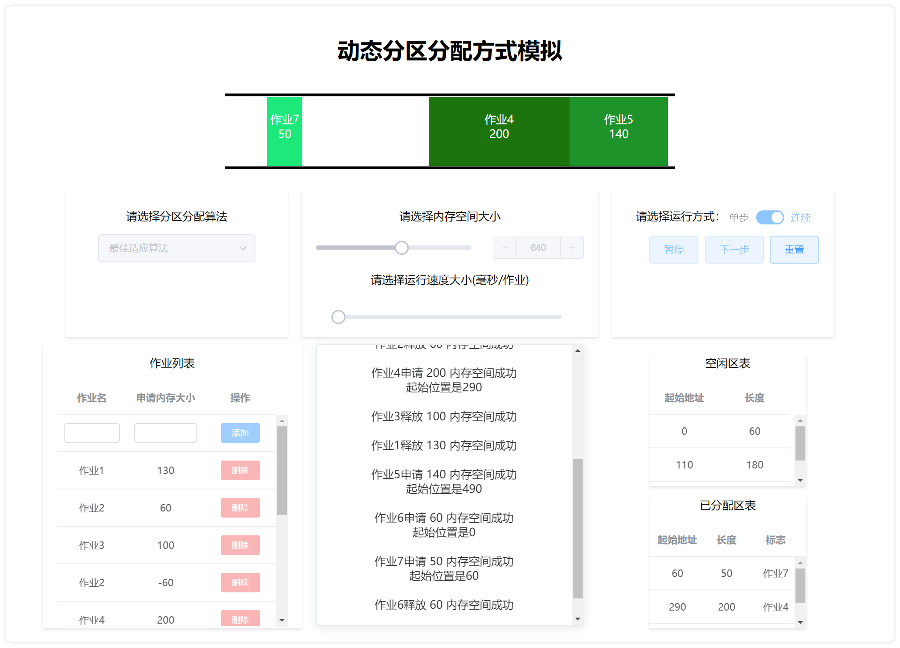
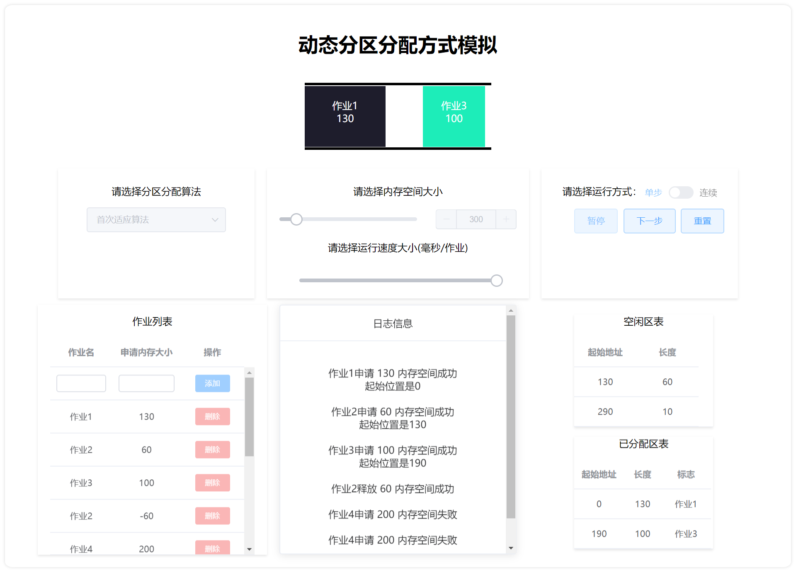

# 内存管理 - 动态分区分配方式模拟
>​	**学号**				1851197
​	**姓名**				周楷彬
​	**指导老师**		王冬青老师
​	**上课时间**		周三五六节/周五一二节
​	**联系方式**		*email:* 824999404@qq.com
## 目录
[TOC]
## 项目需求

假设初始态下，可用内存空间为640K，并有下列请求序列，请分别用首次适应算法和最佳适应算法进行内存块的分配和回收，并显示出每次分配和回收后的空闲分区链的情况来。
|   作业        |
| :-----------:|
| 作业1申请130K |
| 作业2申请 60K |
| 作业3申请100k |
| 作业2释放 60K |
| 作业4申请200K |
| 作业3释放100K |
| 作业1释放130K |
| 作业5申请140K |
| 作业6申请 60K |
| 作业7申请 50K |
| 作业6释放 60K |


### 项目目的

- 数据结构、分配算法
- 加深对动态分区存储管理方式及其实现过程的理解
## 开发环境

- **开发环境:** Windows 10

- **开发软件:** 

  1. **Visual Studio Code** *1.45.0*
  2. **Google Chrome** *83.0.4103.97*

- **开发语言:** html, javascript, css

- **主要引用:**
  1. Vue.js
  2. Element UI

## 操作说明

* 解压`src.zip`，双击文件夹内的`index.html`，在浏览器中打开(请用Chrome、Firefox或Microsoft Edge，程序不兼容IE),打开后界面如下图所示

* 选择动态分区分配算法(首次适应算法/最佳适应算法)

* 调节滑动条或在数字输入框中输入数字改变当前内存大小

* 在作业列表中**添加/删除**作业，设置要分配内存的作业和作业申请/释放（正数为申请，负数为释放）内存的大小

* 选择运行方式(单步/连续)和运行速度大小，点击**开始**按钮进行内存分配模拟


* 在连续运行方式下程序会按照运行速度大小连续进行内存分配模拟，点击**暂停**按钮可暂停模拟，点击**继续**按钮可继续模拟；在单步运行方式下程序每次只对一个作业进行内存分配模拟，点击**下一步**按钮可对下一个作业进行内存分配模拟

* 上方的模拟内存会显示每次分配和回收后的空闲分区链的情况(作业在内存中的位置和占用内存大小)

* 下方的日志信息会显示作业**申请/释放**内存的信息

* 右边的空闲区表和已分配区表会显示当前内存空闲块和已分配块的信息

* 点击**重置**会清空内存中的作业以及日志信息、空闲区表和已分配区表, 此时可再次调整内存空间大小、选择分区分配算法等, 并再次进行动态分区分配方式模拟

## 系统分析
### 首次适应算法
  - 算法逻辑: 记录当前内存中被使用的空间, 同时记录当前内存中可以使用的空间(并将其按照物理位置顺序排序)
    
    ​	如果当前作业需要申请内存空间 $\Rightarrow$ 顺序查找第一个大于所需空间的空闲块 $\Rightarrow$ 将占用的内存空标记为被使用 $\Rightarrow$ 空闲块大小和位置做相应的调整
### 最佳适应算法
- 算法逻辑: 记录当前内存中被使用的空间, 同时记录当前内存中可以使用的空间(并将其按照物理容量大小排序)

  ​	如果当前作业需要申请内存空间 $\Rightarrow$ 找出当前容量最小并且满足当前申请需求的物理块 $\Rightarrow$ 将占用的内存空标记为被使用 $\Rightarrow$ 空闲块大小和位置做相应的调整

## 系统设计
### 界面设计

1. **整体设计**

2. **内存模型**
``` html
<!-- 内存模型 -->
<el-row  type="flex" justify="center">
    <el-col id="memory" :span="24">
    </el-col>
</el-row>
```
``` css
/*内存模型样式*/ 
#memory 
{ 
    margin:20px; 
    height: 108px; 
    width: 640px; 
    border-top: 4px solid black; 
    border-bottom: 4px solid black; 
    display: flex; 
}
```
3. **内存块:**
``` css
/* 内存块样式 */
.memory-task{
    position: absolute;
    margin: 1px 0;
    color: white;
    height: 98px;
}
```
4. **选择算法**: 
``` html
<!-- 选择算法 -->
<el-col class="card action" id="selectAlog" :span="6">
    <el-row type="flex" justify="center">
        <p>请选择分区分配算法</p>
    </el-row>
    <el-row type="flex" justify="center">
        <el-select v-model="algorithm" :disabled="isStart">
            <el-option
                v-for="item in alogOptions"
                :key="item.value"
                :label="item.label"
                :value="item.value">
            </el-option>
            </el-select>
    </el-row>
</el-col>
```
5. **选择内存空间大小和运行速度大小**
``` html
<el-col class="card action" id="selectSize" :span="8">
    <!-- 内存空间大小 -->
    <el-row type="flex" justify="center">
        <p>请选择内存空间大小</p>
    </el-row>
    <el-row type="flex" justify="center">
        <el-col id="selectSize" :span="24">
            <el-slider v-model="memorySize" :disabled="isStart"
            :min="minMemorySize" :max="maxMemorySize" step="20"  @input="onSizeChange()"
            show-input></el-slider>
        </el-col>
    </el-row>
    <!-- 运行速度大小 -->
    <el-row type="flex" justify="center">
        <p>请选择运行速度大小(毫秒/作业)</p>
    </el-row>
    <el-row type="flex" justify="center">
        <el-col :span="20">
            <el-slider v-model="speed" :disabled="isStart" style="margin-top: 8px;"
            :min="100" :max="1000" step="50"></el-slider>
        </el-col>
    </el-row>
</el-col>
```
6. **运行控制**
``` html
<el-col class="card action" id="buttons" :span="6">
    <!-- 运行控制 -->
    <el-row type="flex" justify="center" >
        <p>请选择运行方式：
            <!-- 单步/连续 -->
            <el-switch
            v-model="isContinuted" :disabled="isStart"
            active-text="连续" inactive-text="单步">
            </el-switch>
        </p>
    </el-row>
    <el-row type="flex" justify="center" gutter="40"> 
        <el-col :span="6">
            <!-- 开始/暂停/继续按钮 -->
            <el-button type="primary" :disabled="isEnd||(!isContinuted&&isStart)" 
            @click="onStartClick()" plain>
                {{getStartBtnText() }}
            </el-button>
        </el-col>
        <el-col :span="7">
            <!-- 下一步 -->
            <el-button type="primary" :disabled="!isStart||isEnd" 
            @click="onNextClick()" plain>下一步</el-button>
        </el-col>
        <el-col :span="6">
            <!-- 重置 -->
            <el-button type="primary" plain
            @click="onResetClick()">重置</el-button>
        </el-col>
    </el-row>
</el-col>
```
7. **作业列表**
``` html
<!-- 作业列表 -->
<el-col class="card" :span="7">
    <el-row type="flex" justify="center" >
        <p>作业列表</p>
    </el-row>
    <el-row type="flex" justify="center">
        <el-table id="taskTable"
        :data="taskList" max-height="350">
        <el-table-column
            prop="name"
            label="作业名"
            width="100">
            <template slot-scope="scope">
                <div v-if="scope.$index == 0">
                    <el-input size="mini" v-model="newTaskName"></el-input>
                </div>
                <div v-else>{{scope.row.getName()}}</div>
                </template>
        </el-table-column>
        <el-table-column
            prop="size"
            label="申请内存大小"
            width="110">
            <template slot-scope="scope">
                <div v-if="scope.$index == 0">
                    <el-input size="mini" v-model="newTaskSize"></el-input>
                </div>
                <div v-else>{{scope.row.getData()}}</div>
                </template>
        </el-table-column>
        <el-table-column label="操作">
            <template slot-scope="scope">
                <div v-if="scope.$index == 0">
                    <el-button size="mini" type="primary" :disabled="isStart"
                    @click="addTask()">添加</el-button>
                </div>
                <div v-else>
                    <el-button
                    size="mini" type="danger" :disabled="isStart"
                    @click="deleteTask(scope.$index, scope.row)">删除</el-button>
                </div>
                </template>
            </el-table-column>
        </el-table>
    </el-row>
</el-col>
```
8. **日志信息**
``` html
<!-- 日志信息 -->
<el-card id="logBox" class="box-card">
    <div slot="header" class="clearfix">
        <span>日志信息</span>
    </div>
    <div v-for="message in logList">
        <br>
        {{getLogInfo(message)}}
        <div v-if="message.getStatus()==ADDSUCCESS ">
            {{'起始位置是'+message.getStart()}}
        </div> 
    </div>
</el-card>
```
9. **空闲区表和已分配区表**
``` html
<!-- 空闲区表 -->
<div class="card">
    <p>空闲区表</p>
    <el-table
    :data="useableMem" max-height="150">
    <el-table-column
        prop="startPos"
        label="起始地址"
        width="100">
        <template slot-scope="scope">
            {{scope.row.getStart()}}
            </template>
    </el-table-column>
    <el-table-column
        prop="length"
        label="长度"
        width="100">
        <template slot-scope="scope">
            {{scope.row.getSize()}}
            </template>
    </el-table-column>
</el-table>
</div>
<!-- 已分配区表 -->
<div class="card">
    <p>已分配区表</p>
    <el-table
        :data="occupyMem" max-height="150">
        <el-table-column
            prop="startPos"
            label="起始地址"
            width="80">
            <template slot-scope="scope">
                {{scope.row.getStart()}}
                </template>
        </el-table-column>
        <el-table-column
            prop="length"
            label="长度"
            width="60">
            <template slot-scope="scope">
                {{scope.row.getSize()}}
                </template>
        </el-table-column>
        <el-table-column
            prop="mark"
            label="标志"
            width="80">
            <template slot-scope="scope">
                {{taskList[scope.row.getMark()].getName()}}
            </template>
        </el-table-column>
    </el-table>
</div>
```
### 类设计

1. **作业类:** 作业实体
``` js
/**
 * 作业类
 * @param {作业名称} name 
 * @param {申请/释放的空间大小} data 
 */
function Task(name,data)
{
    this.name=name;
    this.data=data;
    this.getName= function(){
        return this.name;
    }
    this.getData= function(){
        return this.data;
    }
}
```

2. **分区类:** 作业占用的内存块
``` js
/**
 * 分区类
 * @param {起始地址} start 
 * @param {长度} size
 * @param {占有标记} mark
 */
function Mem(start,size,mark)
{
    this.start=start;
    this.size=size;
    this.mark=mark;
    this.getStart=function(){
        return this.start;
    }
    this.getSize=function(){
        return this.size;
    }
    this.getMark=function(){
        return this.mark;
    }
}
```
3. **消息类:** 作业申请内存状态消息
``` js
/**
 * 消息类
 * @param {任务名} name
 * @param {任务申请内存空间} data
 * @param {起始地址}    start
 * @param {状态} status
 */
function Message(name,data,start,status)
{
    this.name=name;
    this.data=data;
    this.start=start;
    this.status=status;
    this.getName=function(){
        return this.name;
    }
    this.getData=function(){
        return this.data;
    }
    this.getStart=function(){
        return this.start;
    }
    this.getStatus=function(){
        return this.status;
    }
}
```
### 实例设计
1. **当前作业:**
``` js
currentTask=1;      //当前作业
```
2. **作业列表:**
``` js
// 作业列表
var taskList = [
    new Task("",0),
    new Task("作业1", 130),
    new Task("作业2", 60),
    new Task("作业3", 100),
    new Task("作业2", -60),
    new Task("作业4", 200),
    new Task("作业3", -100),
    new Task("作业1", -130),
    new Task("作业5", 140),
    new Task("作业6", 60),
    new Task("作业7", 50),
    new Task("作业6", -60),
]
```
3. **已分配区表:**
``` js
//已分配区表
occupyMem=[];
```
4. **空闲区表:**
``` js
// 空闲区表
useableMem=[
    new Mem(0,640,-1),
];
```
5. **日志列表:**
``` js
//日志列表
logList=[];
```
### 状态设计

1.添加作业成功:`const ADDSUCCESS = 0;`  
2.添加作业失败:`const ADDFAILED = 1;`        
3.释放作业成功:`const REMOVESUCCESS = 2;`   
4.所有任务都完成:`const TASKEND = 3;`         

## 系统实现
### 实例化Vue
* 实例化Vue，将html界面内容绑定到相应是js中的变量
* 为界面中的控制设置相应的事件处理函数：删除作业事件、添加作业事件、开始/暂停/继续按钮点击事件、下一步按钮点击事件、重置按钮点击事件、动态调整内存模型的大小、将日志消息列表的消息对象转化为文字
* 如果点击**开始**按钮，调用函数`nextAssignment`进行作业分配，**单步**运行方式下只调用一次，**连续**运行方式下使用定时器按照设定的速度连续调用
* 如果点击**重置**按钮 $\Rightarrow$ 清除模拟内存中的所有作业块 $\Rightarrow$ 清空日志信息中的所有日志 $\Rightarrow$ 重置作业列表(从头开始作业调度) $\Rightarrow$ 清空已分配区表 $\Rightarrow$ 清空空闲区表
``` js
app=new Vue({
    el:'#app',
    data:{
        title:"动态分区分配方式模拟",
        alogOptions:[
            {
                value:'first',
                label:'首次适应算法'
            },
            {
                value:'best',
                label:'最佳适应算法'
            }
        ],
        algorithm:'first',  //选择的算法
        memorySize:640,     //内存空间大小
        minMemorySize:200,  //最小内存大小
        maxMemorySize:1000, //最大内存大小
        newTaskName:'',
        newTaskSize:'',
        taskList:taskList,  //作业列表
        occupyMem:occupyMem,   //已分配区表
        useableMem:useableMem,  //空闲区表
        logList:logList,    //日志消息列表
        speed:1000,        //运行速度
        isStart:false,      //开始标志
        isEnd:false,        //结束标志
        isContinuted:true,  //运行方式，连续还是单步
        isPause:false       //暂停标志
    },
    methods:{
        deleteTask(index,row){      //删除作业事件  
            this.taskList.splice(index,1);
        },
        addTask(){                  //添加作业事件
            if(this.newTaskName!=""&&this.newTaskSize!=0)
            {
                this.taskList.push(new Task(this.newTaskName,Number(this.newTaskSize)));       
                this.newTaskName="";
                this.newTaskSize=""; 
            }
        },
        getStartBtnText(){          //根据运行状态改变开始/暂停/继续按钮的文字
            if(this.isStart)
            {
                if(this.isPause) return '继续';
                else return '暂停';
            }
            else return '开始';
        },
        getLogInfo(message){        //将日志消息列表的消息转化为文字
            if(message.getStatus()==ADDSUCCESS)
            {
                return String(message.getName()+'申请 '+message.getData()+' 内存空间成功');
            }
            else if(message.getStatus()==ADDFAILED)
            {
                return String(message.getName()+'申请 '+message.getData()+' 内存空间失败');
            }
            else if(message.getStatus()==REMOVESUCCESS)
            {
                return String(message.getName()+'释放 '+(-message.getData())+' 内存空间成功');
            }
            else 
            {
                return '作业已全部完成';
            }
        },
        onSizeChange(){                 //改变内存大小时动态调整内存模型的大小
            document.getElementById("memory").style.width=String(this.memorySize)+"px";
            useableMem[0].size=this.memorySize;
        },
        onStartClick(){                 //开始/暂停/继续按钮点击事件
            if(!this.isStart)
            {
                this.isStart=true;
                if(this.isContinuted)
                {
                    myTimer=setInterval(nextAssignment,this.speed);
                }
            }
            else
            {
                if(this.isContinuted)
                {
                    if(this.isPause)
                    {
                        this.isPause=false;
                        myTimer=setInterval(nextAssignment,this.speed);
                    }
                    else
                    {
                        this.isPause=true;
                        if(myTimer!=null)
                        {
                            clearInterval(myTimer);
                        }
                    }

                } 
            }

        },
        onNextClick(){          //下一步按钮点击事件
            if(this.isStart)
            {
                nextAssignment();
            }
        },
        onResetClick()          //重置按钮点击事件
        {
            this.isStart=false;
            this.isPause=false;
            this.isEnd=false;
            currentTask=1;
            logList.splice(0,logList.length);
            occupyMem.splice(0,occupyMem.length);
            useableMem.splice(0,useableMem.length);
            useableMem.push(new Mem(0,this.memorySize,-1));
            var mem=document.getElementById("memory");
            mem.innerHTML=''
            if(myTimer!=null)
            {
                clearInterval(myTimer);
            }
        }
    }
});
```
### 下一步作业调度
* 全局变量`currentTask`表示当前执行作业列表的第几个作业
* 依据`currentTask`值进行分支处理:
    * 如果`currentTask`值小于作业列表的长度 $\Rightarrow$ 继续执行下一个作业
    ``` js
    if(Adapt()){//可以装入作业
        currentTask++;
    }
    ```
    * 如果值大于等于作业列表的长度  $\Rightarrow$  所有作业已经执行完毕  $\Rightarrow$  输出相应日志信息，连续运行方式下停止定时器
    ``` js
    if(!app.isEnd)
    {
        logList.push(new Message('',0,0,TASKEND));
        app.isEnd=true;
        if(app.isContinuted)
        {
            if(myTimer!=null)
            {
                clearInterval(myTimer);
            }
        }
    }
    ```
* 执行下一个作业时:
    
    * 如果可以装入作业  $\Rightarrow$ `currentTask`指向下一个作业


### 分区分配算法

- 如果该作业是要申请空间: 

  - 首次适应算法: 

    - 依照`Mem`的起始位置对空闲区表进行排序
    - 寻找第一个能放下该作业的位置

  - 最佳适应算法:

    - 依照`Mem`的大小对空闲区表进行排序
    - 寻找能放下该作业的最小内存位置

    ```javascript
    if(app.algorithm == 'first')        //首次适应算法
    {
        useableMem.sort(compareStart);
    }
    else if(app.algorithm == 'best')   //最佳适应算法
    {
        useableMem.sort(compareSize);
    }
    ```
  - 将这段分区记录在已分配区表中 $\Rightarrow$ 将已分配区表重新排序

  - 将该段的空闲分区的起始位置加上作业申请的内存空间大小

  - 将该段的空闲分区的大小减去作业申请的内存空间大小

  - 在模拟内存中添加一个作业块

  - 在日志信息中增加一条申请成功的消息

    ```javascript
    for (var i = 0; i < useableMem.length; ++i) {
        if (useableMem[i].getSize() > data)    //第一个能放下的位置
        { 
            start = useableMem[i].getStart();
            size = useableMem[i].getSize();

            occupyMem.push(new Mem(start, data,currentTask));
            occupyMem.sort(compareStart);

            useableMem[i].start += data;
            useableMem[i].size -= data;

            addTask(name, start, data);
            logList.push(new Message(name,data,start,ADDSUCCESS));

            return true;
        }
    }
    ```

- 如果该作业是要释放空间:

  - 在模拟内存中清除该作业块

  - 获取该作业的起始位置和占用内存大小

  - 清除已分配区表中该作业的内存分区

  - 在空闲区表末尾添加一块新的可以使用的内存分区

  - 对可用内存重新整理

  - 添加一条释放成功的日志信息

    ```javascript
    var task = document.getElementById("task_" + name);
    document.getElementById("memory").removeChild(task); //清除作业块

    for (var i = 0; i < occupyMem.length; ++i) {
        if(taskList[occupyMem[i].getMark()].getName()==taskList[currentTask].getName()) 
        //在已分配区表中找到当前作业占用的分区
        {
            var start=occupyMem[i].getStart();
            var size=occupyMem[i].getSize();
            useableMem.push(new Mem(start, size,-1));   //在空闲区表添加一块新分区
            occupyMem.splice(i,1);
            break;
        }
    }

    updateUseable(); //对空闲分区重新整理

    logList.push(new Message(name,data,0,REMOVESUCCESS));

    return true;
    ```

- 如果申请失败:

  - 在日志信息中添加一条申请失败的日志信息

    ```javascript
    logList.push(new Message(name,data,0,ADDFAILED));
    return false;
    ```
### 重新整理空闲分区

- 每次释放一个作业之后要对空闲区表进行更新

- 先将其依照`Mem`的起始位置进行排序

- 当前空闲块和后面的空闲块可以合并, 持续循环合并 $\Rightarrow$ 合并后删除后面的空闲块

- 直到整个空闲区表被遍历完

    ```javascript
    /**对空闲分区重新整理 */
    function updateUseable() {
    useableMem.sort(compareStart)

    var i = 0;
    while (i < useableMem.length) {
        while (i + 1 < useableMem.length &&             //当前空闲块和后面的空闲块可以合并,持续循环合并
            (useableMem[i].getStart() + useableMem[i].getSize() == useableMem[i + 1].getStart())) {
            useableMem[i].size += useableMem[i + 1].getSize();
            useableMem.splice(i + 1, 1);    //合并后删除后面的空闲块
        }
        ++i;
    }
    }
    ```
### 添加一个作业块
``` js
/**
 * 添加一个作业块
 * @param {作业名称} name 
 * @param {起始位置} start 
 * @param {作业数据信息} data 
 */
function addTask(name, start, data) {
    var mem=document.getElementById("memory");
    var task = document.createElement("div");
    task.classList.add('memory-task');
    task.id = "task_" + name;
    task.innerText = "\n" + name + "\n" + data + "\n"; //作业块内部显示作业名和作业大小
    task.style.background =  randomBrightness(0.95,1.); //随机配色
    task.style.width = String(data) + "px"; //作业块的宽度为作业大小

    /*实现以内存左端点为基准定位 */
    task.style.marginLeft = String(start) + "px";

    mem.appendChild(task);
}
```
## 功能实现截屏展示

### 首次适应算法


### 最佳适应算法

### 日志信息


### 内存空间不足

### 添加/删除作业


### 选择分区分配算法

### 选择内存空间大小


### 空闲区表和已分配区表
